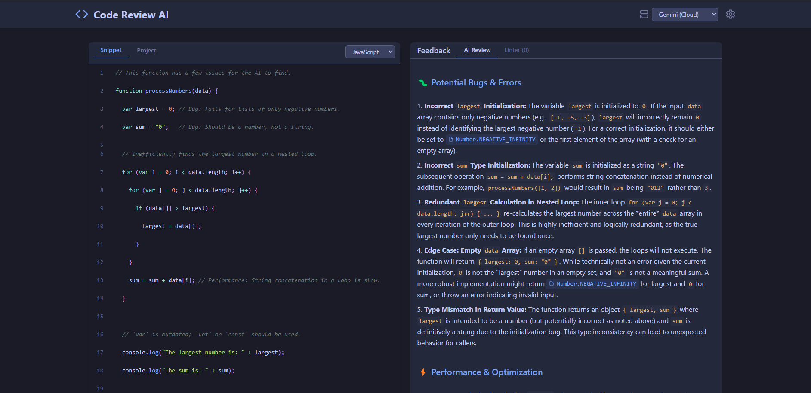

# Code Reviewer AI

[](https://code-reviewer-ai.netlify.app/)
[](https://github.com/deoninja/Code-Reviewer-AI/blob/main/LICENSE)
[](https://github.com/deoninja/Code-Reviewer-AI/stargazers)

Code Reviewer AI is a powerful tool that leverages artificial intelligence to analyze your code and provide feedback. It helps you identify potential bugs, improve code quality, and enforce best practices.

### Screenshot



## Table of Contents

- [Features](#features)
- [Technologies](#technologies)
- [Running Locally](#running-locally)
- [AI Provider Setup](#ai-provider-setup)
  - [Option 1: Google Gemini (Cloud-based)](#option-1-google-gemini-cloud-based)
  - [Option 2: Ollama (Local AI - Completely Offline)](#option-2-ollama-local-ai---completely-offline)
  - [Option 3: LM Studio (Local AI with GUI)](#option-3-lm-studio-local-ai-with-gui)
- [Comparing AI Providers](#comparing-ai-providers)
- [Recommended Configurations](#recommended-configurations)
- [Contributing](#contributing)
- [License](#license)
- [Author](#author)
- [Acknowledgments](#acknowledgments)
- [Project Status](#project-status)
- [Future Plans](#future-plans)
- [Bug Reports](#bug-reports)
- [Feature Requests](#feature-requests)
- [Support](#support)
- [Code of Conduct](#code-of-conduct)

## Features

- **AI-powered Code Review:** Get intelligent feedback on your code.
- **Multiple AI Providers:** Choose between Google Gemini, Ollama (Local), and LM Studio (Local).
- **File Tree Navigation:** Easily browse and select files from your project.
- **Code Formatting:** Format your code with the click of a button.
- **Linter Integration:** Identify and fix syntax errors and style issues.
- **Welcome Message:** Get started quickly with a helpful welcome message.

## Technologies

- [React](https://reactjs.org/)
- [Vite](https://vitejs.dev/)
- [Tailwind CSS](https://tailwindcss.com/)
- [TypeScript](https://www.typescriptlang.org/)
- [@google/genai](https://www.npmjs.com/package/@google/genai)
- [prismjs](https://prismjs.com/)
- [react-simple-code-editor](https://www.npmjs.com/package/react-simple-code-editor)

## Running Locally

1.  **Clone the repository:**

    ```bash
    git clone https://github.com/deoninja/Code-Reviewer-AI.git
    cd Code-Reviewer-AI
    ```

2.  **Install dependencies:**

    ```bash
    npm install
    ```

3.  **Run the development server:**

    ```bash
    npm run dev
    ```

4.  Open your browser and navigate to `http://localhost:5173` (or the address shown in your terminal).

## AI Provider Setup

### Option 1: Google Gemini (Cloud-based)

1. Visit [Google AI Studio](https://aistudio.google.com/app/apikey)
2. Sign in with your Google account
3. Click "Create API Key"
4. Choose "Create API key in new project" or select an existing project
5. Copy the generated API key
6. **Important**: Keep your API key secure and never share it publicly

#### API Key Limits

- Gemini API has generous free tier limits
- Rate limits apply (requests per minute)
- Monitor your usage in the Google AI Studio dashboard

### Option 2: Ollama (Local AI - Completely Offline)

Ollama allows you to run large language models locally on your machine, providing complete privacy and offline functionality.

#### Installing Ollama

**Windows:**

1. Download Ollama from [https://ollama.ai/download](https://ollama.ai/download)
2. Run the installer and follow the setup wizard
3. Ollama will automatically start as a service

**macOS:**

1. Download Ollama from [https://ollama.ai/download](https://ollama.ai/download)
2. Drag Ollama to your Applications folder
3. Run Ollama from Applications

**Linux:**

```bash
curl -fsSL https://ollama.ai/install.sh | sh
```

#### Setting Up Models

1. **Install a recommended model** (choose one based on your system):

   ```bash
   # For systems with 8GB+ RAM - Good balance of speed and quality
   ollama pull llama3.1:8b

   # For systems with 16GB+ RAM - Better quality
   ollama pull llama3.1:13b

   # For systems with 4-8GB RAM - Faster but lower quality
   ollama pull llama3.1:3b

   # Alternative: Code-specific model
   ollama pull codellama:7b
   ```

2. **Verify Ollama is running**:

   ```bash
   ollama list
   ```

3. **Test the model**:
   ```bash
   ollama run llama3.1:8b "Hello, can you help me review code?"
   ```

#### Configuring Code Review AI for Ollama

1. Open the Code Review AI application
2. Click the settings icon
3. Change the AI Provider to "Ollama (Local)"
4. Configure the settings:
   - **URL**: `http://localhost:11434/v1/chat/completions` (default)
   - **Model**: Enter the model name you installed (e.g., `llama3.1:8b`)
5. Click "Save Configuration"

#### Ollama Troubleshooting

**Ollama not responding:**

- Check if Ollama service is running: `ollama ps`
- Restart Ollama: `ollama serve`
- Check firewall settings (port 11434)

**Model not found:**

- List installed models: `ollama list`
- Pull the model again: `ollama pull model-name`

**Performance issues:**

- Use a smaller model for faster responses
- Close other memory-intensive applications
- Consider upgrading RAM for larger models

### Option 3: LM Studio (Local AI with GUI)

LM Studio provides a user-friendly interface for running local language models with excellent performance optimization.

#### Installing LM Studio

1. **Download LM Studio**:

   - Visit [https://lmstudio.ai/](https://lmstudio.ai/)
   - Download for your operating system (Windows, macOS, Linux)
   - Install following the standard process

2. **First-time Setup**:
   - Launch LM Studio
   - The application will guide you through initial setup
   - No account required - everything runs locally

#### Setting Up Models in LM Studio

1. **Browse and Download Models**:

   - Open LM Studio
   - Go to the "Discover" tab
   - Search for recommended models:
     - **Llama 3.1 8B** - Good balance for most systems
     - **Code Llama 7B** - Optimized for code tasks
     - **Mistral 7B** - Fast and efficient
     - **Phi-3 Mini** - Lightweight option

2. **Download a Model**:

   - Click on your chosen model
   - Select the quantization level:
     - **Q4_K_M** - Good balance of quality and speed (recommended)
     - **Q8_0** - Higher quality, needs more RAM
     - **Q2_K** - Faster, lower quality
   - Click "Download"

3. **Load the Model**:
   - Go to the "Chat" tab
   - Click "Select a model to load"
   - Choose your downloaded model
   - Wait for it to load (may take a few minutes)

#### Starting LM Studio Server

1. **Enable Server Mode**:

   - Go to the "Local Server" tab in LM Studio
   - Select your loaded model
   - Click "Start Server"
   - Note the server URL (usually `http://localhost:1234`)

2. **Verify Server is Running**:
   - You should see "Server running on http://localhost:1234"
   - The status indicator should be green

#### Configuring Code Review AI for LM Studio

1. Open the Code Review AI application
2. Click the settings icon
3. Change the AI Provider to "LM Studio (Local)"
4. Configure the settings:
   - **URL**: `http://localhost:1234/v1/chat/completions` (default)
   - **Model**: Use `local-model` or check LM Studio for the exact model name
5. Click "Save Configuration"

#### LM Studio Troubleshooting

**Server won't start:**

- Ensure a model is loaded in the Chat tab first
- Check if port 1234 is available
- Restart LM Studio

**Connection refused:**

- Verify the server is running (green status in Local Server tab)
- Check the URL in settings matches LM Studio's server URL
- Disable firewall/antivirus temporarily to test

**Poor performance:**

- Try a smaller model or lower quantization
- Adjust context length in LM Studio settings
- Close other applications to free up RAM

## Comparing AI Providers

| Feature               | Gemini (Cloud)            | Ollama (Local)         | LM Studio (Local)      |
| --------------------- | ------------------------- | ---------------------- | ---------------------- |
| **Setup Difficulty**  | Easy                      | Medium                 | Easy                   |
| **Internet Required** | Yes                       | No                     | No                     |
| **Privacy**           | Data sent to Google       | Complete privacy       | Complete privacy       |
| **Speed**             | Fast                      | Depends on hardware    | Depends on hardware    |
| **Cost**              | Free tier, then paid      | Free                   | Free                   |
| **Model Quality**     | Very High                 | High (varies by model) | High (varies by model) |
| **RAM Requirements**  | None                      | 4-16GB+                | 4-16GB+                |
| **Best For**          | Quick setup, high quality | Privacy, offline use   | User-friendly local AI |

## Recommended Configurations

### For Beginners

- **Start with**: Gemini (easiest setup)
- **Upgrade to**: LM Studio (user-friendly local option)

### For Privacy-Conscious Users

- **Recommended**: Ollama with Llama 3.1 8B
- **Alternative**: LM Studio with Code Llama 7B

### For Low-End Hardware (4-8GB RAM)

- **Ollama**: `llama3.1:3b` or `phi3:mini`
- **LM Studio**: Phi-3 Mini with Q4_K_M quantization

### For High-End Hardware (16GB+ RAM)

- **Ollama**: `llama3.1:13b` or `codellama:13b`
- **LM Studio**: Llama 3.1 8B with Q8_0 quantization

## Contributing

Contributions are welcome! Please see our [Contributing Guide](CONTRIBUTING.md) for more information.

## License

This project is licensed under the MIT License - see the [LICENSE](LICENSE) file for details.

## Author

- [Deo Trinidad](https://github.com/deoninja)

## Acknowledgments

- This project was inspired by the need for a simple and effective code review tool.

## Project Status

This project is currently in active development.

## Future Plans

- [ ] Add support for more AI providers.
- [ ] Implement user authentication.
- [ ] Add more options for code formatting.
- [ ] Improve the UI/UX.

## Bug Reports

Please report any bugs or issues you find by opening an issue on the [GitHub repository](https://github.com/deoninja/Code-Reviewer-AI/issues).

## Feature Requests

If you have an idea for a new feature, please open an issue on the [GitHub repository](https://github.com/deoninja/Code-Reviewer-AI/issues) to discuss it.

## Support

For support, please open an issue on the [GitHub repository](https://github.com/deoninja/Code-Reviewer-AI/issues).

## Code of Conduct

Please read our [Code of Conduct](CODE_OF_CONDUCT.md) for details on our code of conduct and the process for submitting a report.

---

All rights reserved Deo Trinidad ©️ 2025

[Back to top](#code-reviewer-ai)
